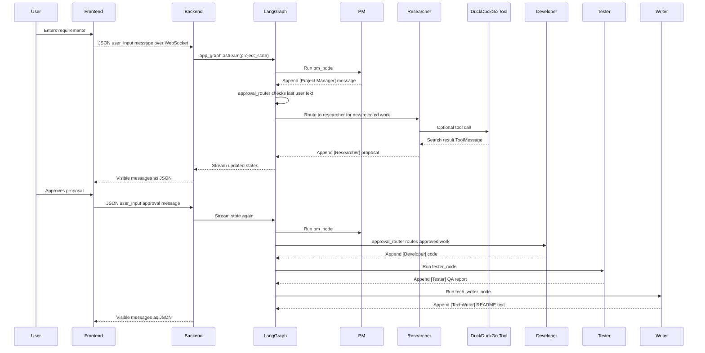

# Oxygen Codebase Analysis

This document explains how the Oxygen project currently works by reading the
actual source code. It intentionally separates implemented behavior from claims
in `README.md`. The README describes guardrails, metrics, and evaluations as if
they are production systems, but those are not implemented in the codebase.

## 1. Project Summary

Oxygen is a small human-in-the-loop multi-agent demo application.

It has:

- A Python FastAPI backend with one WebSocket endpoint.
- A LangGraph workflow that calls five LLM-powered agent nodes.
- A vanilla HTML, CSS, and JavaScript frontend.
- A canvas-based virtual office animation.
- A settings modal for selecting Gemini or Ollama.
- A researcher agent that can call DuckDuckGo search through LangChain tools.

The system does not edit the local filesystem to create projects. Instead, the
LLM agents generate text and code blocks in chat. The frontend detects Markdown
code blocks and turns them into downloadable file cards in the browser.

## 2. High-Level Runtime Flow

The normal user flow is:

1. The user opens `frontend/index.html`.
2. `frontend/js/socket.js` opens a WebSocket connection to
   `ws://127.0.0.1:8000/ws`.
3. The frontend sends the selected LLM config to the backend.
4. The user submits requirements.
5. The backend appends the user text to a per-connection `project_state`.
6. The backend streams that state through the compiled LangGraph app.
7. The Project Manager agent runs first.
8. A router checks the latest user message for approval or rejection words.
9. On a new request or rejection, the Researcher runs.
10. The Researcher may call DuckDuckGo search.
11. The Researcher returns a technical proposal.
12. The user manually approves or rejects that proposal in chat.
13. On approval, the Developer runs.
14. The Tester runs after the Developer.
15. The Technical Writer runs after the Tester.
16. The backend sends visible agent messages to the frontend as JSON.
17. The frontend displays the chat and animates the active agent.

In diagram form:



## 3. Tech Stack

### Backend

- Python.
- FastAPI for the WebSocket API.
- Uvicorn for serving the FastAPI app.
- LangGraph for graph orchestration.
- LangChain for model wrappers and tools.
- `langchain-google-genai` for Gemini chat models.
- `langchain-ollama` for local Ollama chat models.
- `langchain-community` for DuckDuckGo search.
- `duckduckgo-search` as the underlying search integration.
- `python-dotenv` for reading `.env`.
- `websockets`, listed as a dependency for WebSocket support.

### Frontend

- HTML5.
- CSS3.
- Vanilla JavaScript.
- Browser WebSocket API.
- Browser LocalStorage API.
- Browser Canvas 2D API.

There is no frontend build system, no TypeScript, no React/Vue/Svelte, no bundler,
and no package manifest.

## 4. Backend Architecture

The backend is centered around `backend/main.py` and `backend/graph.py`.

`backend/main.py` creates the FastAPI app and exposes `/ws`.

`backend/graph.py` creates and compiles the LangGraph workflow.

The graph uses `AgentState` from `backend/state.py`. Each graph node receives a
state dictionary and returns partial state updates. The most important state key
is `messages`.

The graph nodes are:

- `pm`
- `researcher`
- `tools`
- `developer`
- `tester`
- `writer`

The compiled graph is exported as `app_graph`.

## 5. State Model

`backend/state.py` defines this `TypedDict`:

```python
class AgentState(TypedDict):
    messages: Annotated[list[dict], add_messages]
    config: dict
    project_requirements: str
    proposal_draft: str
    source_code: str
    test_results: str
    documentation: str
    pm_status: str
    researcher_status: str
    dev_status: str
    tester_status: str
    writer_status: str
```

Only some of these fields are actively used.

Implemented:

- `messages`
- `config`
- `pm_status`
- `researcher_status`
- `dev_status`
- `tester_status`
- `writer_status`

Declared but not populated by any agent:

- `project_requirements`
- `proposal_draft`
- `source_code`
- `test_results`
- `documentation`

The declared lifecycle fields look like planned structured state, but the
current implementation passes almost everything through `messages`.

The reducer:

```python
def add_messages(left: list, right: list) -> list:
    return left + right
```

means every node that returns `{"messages": [...]}` appends to the existing
conversation rather than replacing it.

## 6. How Information Passes From Agent To Agent

Information is passed through the shared LangGraph state, mainly through
`state["messages"]`.

Each agent does this pattern:

1. Read `messages = state.get("messages", [])`.
2. Create a role-specific system prompt.
3. Add all previous messages into the model call.
4. Add an extra synthetic user instruction in some nodes.
5. Invoke the selected LLM.
6. Return a new assistant message with a text tag.

The tags are:

- `[Project Manager]:`
- `[Researcher]:`
- `[Developer]:`
- `[Tester]:`
- `[TechWriter]:`

Those tags are not LangGraph roles. They are plain text prefixes inside the
assistant message content. The backend later uses them to decide which label and
agent name to send to the frontend.

Example handoff:

```python
return {
    "messages": [{"role": "assistant", "content": f"[Developer]: {reply_text}"}],
    "dev_status": "writing_code"
}
```

The next agent receives that message as part of the full `messages` list. The
next agent "understands" the previous work because the previous agent's output
is included in the prompt context. There is no separate parser, schema, object
model, embedding memory, or typed artifact handoff.

## 7. WebSocket Message Formats

### Frontend To Backend: Config

The frontend sends this when the socket opens and whenever settings are saved:

```json
{
  "type": "config",
  "config": {
    "provider": "gemini",
    "model": "gemini-1.5-flash",
    "api_key": ""
  }
}
```

For Ollama:

```json
{
  "type": "config",
  "config": {
    "provider": "ollama",
    "model": "llama3.1",
    "api_key": ""
  }
}
```

### Frontend To Backend: User Input

```json
{
  "type": "user_input",
  "content": "Build me a todo app with auth"
}
```

`backend/main.py` ignores the user input `type` and only reads `content`, unless
the type is `config`.

### Backend To Frontend: Agent Output

```json
{
  "agent": "researcher",
  "label": "AI Researcher",
  "content": "Here is the proposed architecture..."
}
```

Valid frontend agent ids are:

- `pm`
- `researcher`
- `developer`
- `tester`
- `writer`

These ids drive both chat badge styling and virtual office animation.

## 8. Human-In-The-Loop Behavior

The human-in-the-loop mechanism is implemented in `approval_router` inside
`backend/graph.py`.

After the Project Manager runs, the router:

1. Scans all messages.
2. Keeps only messages whose role/type is `user` or `human`.
3. Lowercases their content.
4. Looks at the latest user/human message.
5. Checks whether it contains an approval or rejection substring.

Approval words:

```python
["accept", "approve", "looks good", "ok", "proceed", "yes", "go ahead", "sure"]
```

Rejection words:

```python
["reject", "change", "no", "stop", "wait"]
```

Routing behavior:

- If the latest user text contains any approval word, route to `developer`.
- Else if it contains any rejection word, route to `researcher`.
- Else route to `researcher`.

This means the human gate is real, but simple. The graph will not go from a
Researcher proposal to Developer in the same turn unless the user's latest
message contains an approval phrase.

Important limitation: the router does not verify that a proposal actually
exists. If the user's first message says "yes, build a todo app", the substring
`yes` can route to the Developer after the PM instead of the Researcher.

Another limitation: matching uses raw substring checks. This can create false
matches. For example:

- `unacceptable` contains `accept`, so it can be treated as approval.
- `ensure` contains `sure`, so it can be treated as approval.
- `node.js` contains `no`, so it can be treated as rejection.
- `not` starts with `no`, so it can be treated as rejection.

## 9. What Happens On Approval, Rejection, And Scolding

### Approval

If the latest user message contains an approval word:

1. PM runs and acknowledges the approval.
2. `approval_router` returns `developer`.
3. `dev_node` generates foundational code.
4. `tester_node` reviews the generated code.
5. `tech_writer_node` writes final documentation.
6. Graph reaches `END`.

There is no additional approval gate after QA.

### Rejection

If the latest user message contains a rejection word:

1. PM runs and acknowledges the feedback.
2. `approval_router` returns `researcher`.
3. `research_node` runs again with the full conversation history.
4. The Researcher may search again.
5. The Researcher returns a revised proposal.
6. The graph ends after the Researcher proposal unless tool calls are made.

After rejection, the user must send another approval phrase to move to
Developer.

### Scolding Or Negative Feedback

There is no special "scolding" detector.

Scolding is treated as ordinary user input. The result depends entirely on
whether the message contains one of the simple router substrings:

- "This is bad, change it" routes to Researcher because of `change`.
- "No, that is wrong" routes to Researcher because of `no`.
- "This is unacceptable" may incorrectly route to Developer because `accept`
  appears inside `unacceptable`.
- "This is terrible" contains no explicit router keyword, so it defaults to
  Researcher.

The PM prompt says it should acknowledge changes or rejection, so the LLM may
respond empathetically, but there is no code-level emotional-state handling.

## 10. Agent Roles

### Project Manager: Del

File: `backend/agents/pm_agent.py`

Responsibilities:

- First agent to run on every user input.
- Clarifies requirements.
- Acknowledges approvals.
- Acknowledges rejection or change requests.
- Says which agent receives the next handoff.

Implemented guardrail:

- System prompt says not to write code or technical solutions.

Limitations:

- This is prompt-only. There is no validator that blocks code if the PM outputs
  it anyway.

### Researcher: Toky

File: `backend/agents/research_agent.py`

Responsibilities:

- Evaluate requirements.
- Use DuckDuckGo search when tool calling is supported.
- Draft the technical proposal.
- Address the proposal to the PM.

Implemented tool:

- `DuckDuckGoSearchRun`

Important behavior:

- The model is bound with tools via `llm.bind_tools(tools)`.
- If the model returns `tool_calls`, LangGraph sends the workflow to the
  `tools` node.
- The `tools` node executes the search.
- Control returns to the Researcher.
- The Researcher then sees the latest message has role/type `tool` and writes a
  proposal using the tool result.

Fallback behavior:

- If tool binding or invocation fails, the Researcher catches the exception and
  asks the base LLM to write a proposal from internal knowledge.

Limitations:

- Search is encouraged by prompt, but not guaranteed if the model does not make
  a tool call.
- If DuckDuckGo fails after the tool call is emitted, there is no custom error
  recovery around the `ToolNode`.
- Search results are not separately stored or cited by the application.

### Developer: Bang

File: `backend/agents/dev_agent.py`

Responsibilities:

- Read the Researcher's proposal from prior messages.
- Generate foundational source code.
- Address output to the Tester.

The Developer does not write files to disk. It emits Markdown text and code
blocks. The frontend can turn code blocks into downloadable files.

### Tester: Beij

File: `backend/agents/tester_agent.py`

Responsibilities:

- Read the Developer's code from prior messages.
- Produce a formal QA report.
- Identify bugs, edge cases, and optimizations.
- State whether the code is approved for documentation.

Limitations:

- It does not execute tests.
- It does not run static analysis tools.
- It does not parse code into files.
- It is an LLM review only.

### Technical Writer: Wash

File: `backend/agents/tech_writer_agent.py`

Responsibilities:

- Read the Developer output and Tester report from prior messages.
- Generate a README-style Markdown document.
- Address the final response to the user.

Limitations:

- It does not create an actual `README.md` file in the generated project.
- The frontend may offer the Markdown as a downloadable card if the model uses a
  Markdown code block, but plain Markdown text is displayed as chat content.

## 11. LangGraph Routing

`backend/graph.py` defines the graph:

```python
workflow = StateGraph(AgentState)

workflow.add_node("pm", pm_node)
workflow.add_node("researcher", research_node)
workflow.add_node("tools", ToolNode(tools))
workflow.add_node("developer", dev_node)
workflow.add_node("tester", tester_node)
workflow.add_node("writer", tech_writer_node)

workflow.set_entry_point("pm")

workflow.add_conditional_edges("pm", approval_router)
workflow.add_conditional_edges("researcher", tools_condition)
workflow.add_edge("tools", "researcher")

workflow.add_edge("developer", "tester")
workflow.add_edge("tester", "writer")
workflow.add_edge("writer", END)
```

The PM node is always the entry point.

From PM:

- `approval_router` chooses either `researcher` or `developer`.

From Researcher:

- `tools_condition` is a LangGraph helper that checks whether the model output
  contains tool calls.
- If tool calls exist, the graph routes to `tools`.
- If no tool calls exist, the graph ends.

From Developer:

- Always goes to Tester.

From Tester:

- Always goes to Writer.

From Writer:

- Ends.

## 12. Web Tooling

The only web tool in the application is DuckDuckGo search:

```python
from langchain_community.tools import DuckDuckGoSearchRun

search_tool = DuckDuckGoSearchRun()
tools = [search_tool]
```

It is only available to the Researcher.

The app does not expose browser automation, scraping, crawling, file downloads,
or arbitrary HTTP fetch tools.

The tool-call cycle is:

1. Researcher LLM receives the tool schema.
2. LLM decides whether to call the search tool.
3. If it calls the tool, the response contains `tool_calls`.
4. LangGraph `tools_condition` routes to `ToolNode`.
5. `ToolNode(tools)` executes the DuckDuckGo tool.
6. Tool result is appended to `messages` as a tool message.
7. Graph routes back to `researcher`.
8. Researcher writes proposal.

The backend deliberately hides tool messages from the UI:

```python
if not content or msg_type == "tool":
    continue
```

So the user normally sees only the final Researcher message, not raw search
results.

## 13. LLM Provider Selection

`backend/llm_factory.py` creates the model object from `state["config"]`.

Expected config:

```json
{
  "provider": "gemini",
  "model": "gemini-1.5-flash",
  "api_key": ""
}
```

For Ollama:

```json
{
  "provider": "ollama",
  "model": "llama3.1",
  "api_key": ""
}
```

Provider behavior:

- `provider == "ollama"` returns `ChatOllama(model=model_name)`.
- Any other provider defaults to Gemini.
- Gemini uses the UI API key if provided.
- If the UI API key is blank, Gemini falls back to `GOOGLE_API_KEY` from the
  environment.

The backend calls `load_dotenv()` in `backend/main.py`, so root `.env` values can
be loaded before LLM creation.

## 14. Frontend Architecture

The frontend is split into:

- `frontend/index.html`
- `frontend/css/style.css`
- `frontend/js/main.js`
- `frontend/js/socket.js`

### `index.html`

Defines:

- Header and app title.
- System status pill.
- Settings button.
- Virtual office panel.
- Chat panel.
- Chat history.
- User input textarea.
- Send button.
- Settings modal.
- Provider select.
- Model input.
- API key input.
- Script includes.

### `main.js`

Owns the virtual office simulation.

It:

- Initializes `window.activeAgent` and `window.isWorking`.
- Sizes the canvas responsively.
- Defines the virtual office floorplan.
- Defines AI and non-AI employees.
- Draws rooms, props, desks, servers, tables, etc.
- Draws pixel-art avatars from an array-based sprite.
- Makes inactive employees wander.
- Moves the active AI employee to their desk.
- Shows a "Working" speech bubble for active agents.
- Updates the active-agent badge.
- Runs the animation loop with `requestAnimationFrame`.

The virtual office is presentation only. It does not control backend routing.

### `socket.js`

Owns chat, settings, WebSocket communication, and download cards.

It:

- Opens the WebSocket.
- Sends config on connect.
- Saves config to LocalStorage.
- Sends user messages.
- Receives agent messages.
- Sets `window.activeAgent` and `window.isWorking`.
- Appends chat bubbles.
- Detects Markdown code blocks.
- Converts code blocks into downloadable file cards.

## 15. Code Block Download System

The frontend detects code blocks with:

```javascript
const codeBlockRegex = /```(\w+)?\n([\s\S]*?)```/g;
```

For each code block:

1. It reads the optional language tag.
2. It picks a filename.
3. It base64-encodes the code.
4. It replaces the code block with a file card.
5. Clicking Download creates a Blob and triggers a browser download.

Filename logic:

- Writer output becomes `README.md`.
- Tester output becomes `QA_REPORT_<index>.md`.
- Researcher output becomes `ARCHITECTURE_PROPOSAL.md`.
- Developer output becomes `source_code_<index>.<ext>`.
- A first plain text code block can become `requirements.txt`.

Supported extension mapping:

- `python` or `py` -> `.py`
- `cpp` or `c++` -> `.cpp`
- `javascript` or `js` -> `.js`
- `html` -> `.html`
- `css` -> `.css`
- `json` -> `.json`
- `bash` or `sh` -> `.sh`
- `text` or `txt` -> `.txt`

Limitations:

- The parser is regex-based and only handles fenced code blocks with an optional
  word language.
- It does not support filenames in code fences.
- It does not create directories.
- It does not preserve a multi-file project structure except by inferred names.
- It injects formatted HTML through `innerHTML`, so untrusted model output is not
  safely sanitized.

## 16. Storage And Memory

Implemented storage:

- Frontend LocalStorage stores LLM config under `oxygenLlmConfig`.
- Backend stores `project_state` in memory per WebSocket connection.
- Browser downloads are created client-side as Blob files.
- `.env` can store `GOOGLE_API_KEY`.

Not implemented:

- Database.
- Server-side project storage.
- User accounts.
- Session resume after refresh.
- Persistent agent memory.
- Vector store.
- Artifact registry.
- Logs database.
- Saved evaluations.
- Saved metrics.

When the browser refreshes:

- LocalStorage config remains.
- Chat history disappears.
- Backend connection state disappears.

When the WebSocket disconnects:

- `project_state` is lost.

## 17. Context Window Behavior

There is no custom context-window management.

Every agent receives the full accumulated `messages` list. This includes:

- User requirements.
- PM acknowledgements.
- Research proposals.
- Tool-call messages and tool results inside backend state.
- Developer code.
- Tester report.
- Writer output after it exists in later turns.

There is no:

- Token counting.
- Context trimming.
- Summarization.
- Retrieval.
- Message compaction.
- Per-agent memory isolation.
- Artifact extraction into structured fields.

Practical result:

- Short conversations work.
- Long conversations can become slow or expensive.
- The selected LLM may hit its context limit.
- Tool results and generated code can quickly consume the context window.
- A later agent may be distracted by old or irrelevant messages.

If the context window is exceeded, behavior depends on the provider wrapper. The
application does not catch or recover from context-length errors.

## 18. Overload And Failure Behavior

The app has minimal overload handling.

Potential overload cases:

- Too many long messages.
- Large generated code blocks.
- Repeated search results.
- Slow LLM responses.
- Multiple connected clients.
- DuckDuckGo failures.
- Missing API key.
- Ollama server not running.
- Tool-calling unsupported by a local model.

Implemented handling:

- Researcher catches exceptions around `llm_with_tools.invoke(...)` and falls
  back to a no-tool proposal.
- WebSocket disconnects are caught.

Not implemented:

- Global exception handling around the full graph stream.
- Retry logic.
- Request timeout.
- Queueing.
- Rate limiting.
- Backpressure.
- Token budget enforcement.
- Model availability checks.
- User-facing error messages for most backend failures.

If an exception occurs outside the Researcher tool-binding fallback, the
WebSocket handler will likely terminate and the frontend may simply stop
receiving messages.

## 19. Guardrails

The README claims rigorous guardrails. In the actual code, guardrails are light.

Implemented guardrails:

- PM system prompt says not to write code.
- The graph requires an approval-like latest user message before routing to the
  Developer.
- Tool messages are hidden from the frontend.
- The frontend turns code blocks into downloadable cards instead of rendering raw
  fenced code.

Not implemented:

- Policy engine.
- Output validation.
- Prompt-injection detection.
- Security scanning.
- Sandboxed code execution.
- Real "hallucination rate" measurement.
- Role violation detector.
- Structured proposal approval object.
- Authorization or authentication.
- API key redaction in server logs.
- XSS-safe message rendering.
- Content moderation.

Important note: prompt instructions are useful but not hard security controls.
For example, the PM can still output code if the model disobeys the prompt,
because no code-level validator checks the PM response.

## 20. Metrics

There are no real metrics in the code.

The backend uses `print(...)` statements such as:

- "Frontend connected to Oxygen Backend!"
- "Received new LLM config"
- "Invoking LangGraph AI with streaming..."
- "ROUTE: Proposal Accepted -> Going to Developer"

Not implemented:

- Latency measurement.
- Token usage measurement.
- Cost tracking.
- Per-agent success rate.
- Tool-call success rate.
- Rejection/approval counts.
- Context length tracking.
- Error counters.
- OpenTelemetry.
- Prometheus.
- LangSmith tracing.
- Analytics dashboard.

The README's claims such as routing latency under 150ms, hallucination rate under
1%, token efficiency measurements, and 0% UI malformation rate are not measured
by the application.

## 21. Evaluation

There is no evaluation framework.

Not present:

- Unit tests.
- Integration tests.
- Agent eval datasets.
- Golden conversations.
- Regression tests.
- Prompt evals.
- Tool-use evals.
- Human scoring workflows.
- CI configuration.

The QA agent is not an evaluation system. It is another LLM call that writes a
QA-style report based on the Developer's output.

## 22. How Agents "Understand" Work

The agents understand work through normal LLM prompting.

Each node gives the model:

- A role-specific system prompt.
- The full message history.
- Sometimes an extra instruction from the orchestrator.

The model then infers:

- What the user wants.
- Which previous agent said what.
- Which proposal was approved.
- What code should be written.
- What should be tested.
- What documentation should say.

There is no symbolic planner, AST parser, typed requirements schema, task graph,
or formal intermediate representation. The "understanding" is emergent from the
LLM processing the prompt text.

## 23. Actual Runtime Data Example

After a new project request, backend state may look like this:

```json
{
  "messages": [
    {
      "role": "user",
      "content": "Build a todo app"
    },
    {
      "role": "assistant",
      "content": "[Project Manager]: Understood. I am handing this to the Researcher."
    },
    {
      "role": "assistant",
      "content": "[Researcher]: Here is the technical proposal..."
    }
  ],
  "config": {
    "provider": "gemini",
    "model": "gemini-1.5-flash",
    "api_key": ""
  },
  "pm_status": "gathering_requirements",
  "researcher_status": "researching_tech_stack"
}
```

If a tool call happens, `messages` may also contain LangChain `AIMessage` and
`ToolMessage` objects, not only plain dictionaries. The backend handles both
shapes by checking `hasattr(msg, "content")` and `hasattr(msg, "type")`.

## 24. File-By-File Role

### `README.md`

Project marketing and setup documentation. It describes the intended system,
architecture, agent roles, installation, and usage.

Important caveat: its guardrail, metrics, and evaluation claims are not backed
by implementation in the source code.

### `LICENSE`

Apache License 2.0 text.

### `.gitignore`

Ignores:

- `.env`
- `backend/.env`
- `__pycache__/`

### `.env` and `.env.local`

Environment files exist in the workspace but should be treated as secret-bearing
local configuration. The backend can use `.env` for `GOOGLE_API_KEY`.

### `backend/requirements.txt`

Python dependencies for the backend.

Current listed packages:

- `fastapi`
- `uvicorn`
- `websockets`
- `langgraph`
- `langchain-core`
- `python-dotenv`
- `langchain-google-genai`
- `duckduckgo-search`
- `langchain-community`
- `langchain-ollama`

The working tree currently shows `langchain-ollama` as an uncommitted addition.

### `backend/main.py`

Backend entrypoint.

Main responsibilities:

- Load environment variables with `load_dotenv()`.
- Create the FastAPI app.
- Accept WebSocket connections at `/ws`.
- Maintain one `project_state` dictionary per connection.
- Receive config and user input JSON.
- Append user input into state.
- Stream the LangGraph app with `app_graph.astream(...)`.
- Diff newly appended messages by message count.
- Convert tagged assistant messages into frontend agent ids.
- Hide tool messages.
- Send visible messages to the frontend.

Important details:

- `project_state` is local to a WebSocket connection.
- Config updates do not invoke the graph.
- User messages are appended as dictionaries.
- LangGraph may append LangChain message objects.
- The backend handles both dictionaries and message objects.

Potential issue:

- `uvicorn.run("main:app", ...)` inside the `__main__` block may be less robust
  than `uvicorn.run("backend.main:app", ...)` depending on how the script is
  launched. The README's `uvicorn backend.main:app --reload` command is the safer
  path.

### `backend/graph.py`

LangGraph workflow definition.

Main responsibilities:

- Import all agent nodes.
- Import Researcher tools.
- Define `approval_router`.
- Create `StateGraph`.
- Add graph nodes.
- Add graph edges.
- Compile the graph into `app_graph`.

Important details:

- PM is always the entry point.
- Approval routing is keyword-based.
- Researcher uses LangGraph's `tools_condition`.
- Developer, Tester, and Writer run sequentially after approval.

### `backend/state.py`

Shared state schema for LangGraph.

Main responsibilities:

- Define `add_messages` reducer.
- Define `AgentState`.

Important details:

- `messages` appends instead of replacing.
- Several lifecycle fields are declared but unused.

### `backend/llm_factory.py`

LLM provider factory.

Main responsibilities:

- Read `provider`, `model`, and `api_key` from config.
- Return `ChatOllama` for Ollama.
- Return `ChatGoogleGenerativeAI` for Gemini.
- Fall back to `GOOGLE_API_KEY` from environment if no UI key is provided.

Limitations:

- No validation for missing API keys.
- No health check for Ollama.
- No provider allowlist beyond the `ollama` branch and Gemini default.

### `backend/agents/pm_agent.py`

Project Manager agent node.

Main responsibilities:

- Instantiate configured LLM.
- Prompt the model as Del, the PM.
- Tell the model not to write code.
- Return a `[Project Manager]:` message.
- Set `pm_status`.

### `backend/agents/research_agent.py`

Researcher agent node and tool definition.

Main responsibilities:

- Create `DuckDuckGoSearchRun`.
- Expose `tools = [search_tool]`.
- Bind tools to the selected LLM.
- Prompt the model as the Technical Researcher.
- Ask it to use search before proposing a stack.
- Return tool-call messages when the LLM calls a tool.
- Return a `[Researcher]:` proposal when no tool call is pending.
- Fall back to no-tool proposal generation if tool binding/invocation fails.

### `backend/agents/dev_agent.py`

Developer agent node.

Main responsibilities:

- Prompt the model as Bang, the Senior Developer.
- Include the full message history.
- Ask for foundational code based on the approved proposal.
- Return a `[Developer]:` message.
- Set `dev_status`.

### `backend/agents/tester_agent.py`

QA agent node.

Main responsibilities:

- Prompt the model as Beij, the QA Tester.
- Include the full message history.
- Ask for a formal QA report.
- Return a `[Tester]:` message.
- Set `tester_status`.

### `backend/agents/tech_writer_agent.py`

Technical Writer agent node.

Main responsibilities:

- Prompt the model as Wash, the Technical Writer.
- Include the full message history.
- Ask for final README documentation.
- Return a `[TechWriter]:` message.
- Set `writer_status`.

### `frontend/index.html`

Static HTML shell.

Main responsibilities:

- Define the app layout.
- Define the virtual office canvas.
- Define chat history and input controls.
- Define the settings modal.
- Load `css/style.css`.
- Load `js/main.js`.
- Load `js/socket.js`.

### `frontend/css/style.css`

Application styling.

Main responsibilities:

- Define color variables.
- Style the header, panels, chat, buttons, modal, badges, and file cards.
- Make the main layout responsive.
- Add pulse and fade-in animations.
- Style custom scrollbars.

### `frontend/js/main.js`

Canvas virtual office engine.

Main responsibilities:

- Manage canvas sizing and scaling.
- Define rooms and props.
- Define employees.
- Draw the office.
- Draw pixel-art avatars.
- Animate wandering behavior.
- Move active AI agents to desks.
- Draw desk monitor glow and "Working" bubble.
- Update the active-agent badge.

### `frontend/js/socket.js`

Frontend communication and chat controller.

Main responsibilities:

- Store and load LLM config in LocalStorage.
- Open the backend WebSocket.
- Send config.
- Send user messages.
- Receive agent messages.
- Append chat bubbles.
- Set active agent animation globals.
- Convert Markdown code blocks into downloadable cards.

Security note:

- It uses `innerHTML` with model-provided content. This is fine for a local demo
  but unsafe for untrusted production use without sanitization.

### `screenshot/HomePage.png`

Screenshot used by the README.

## 25. Important Gaps And Risks

The codebase is a good demo, but these are the main gaps:

- Guardrails are mostly prompts, not enforcement.
- Human approval is keyword-based and fragile.
- False approval/rejection matches are possible.
- No durable storage exists.
- No generated files are written server-side.
- No metrics exist.
- No evaluations exist.
- No tests exist.
- No authentication exists.
- No rate limiting exists.
- No context-window management exists.
- No structured artifacts are extracted.
- No retries or robust error handling around most LLM failures.
- Tool results are hidden from users and not cited in a structured way.
- Frontend rendering is vulnerable to unsafe HTML injection from model output.
- API key config can be sent over plain local WebSocket, acceptable locally but
  not production-ready.

## 26. What Is Real Versus Fake In The README

Real:

- Multi-agent graph.
- Human-in-the-loop approval router.
- FastAPI WebSocket backend.
- LangGraph orchestration.
- Gemini and Ollama model selection.
- DuckDuckGo search tool for the Researcher.
- Canvas virtual office.
- Code block download cards.

Overstated or fake:

- Rigorous evaluations.
- Measured routing latency under 150ms.
- Hallucination rate under 1%.
- Token efficiency metrics.
- 0% UI malformation rate.
- Strict guardrail enforcement.
- Distinct persisted context states for lifecycle artifacts.
- Robust production-grade safety constraints.

## 27. Best Mental Model

The best way to understand Oxygen is:

Oxygen is a chat application wrapped around a LangGraph agent pipeline. The
agents do not pass typed project objects to each other. They pass text through a
shared message history. The human-in-the-loop step is a keyword router that
decides whether the next stage should revise the proposal or generate code. The
frontend is a polished visualization and download layer, not the source of agent
logic.

