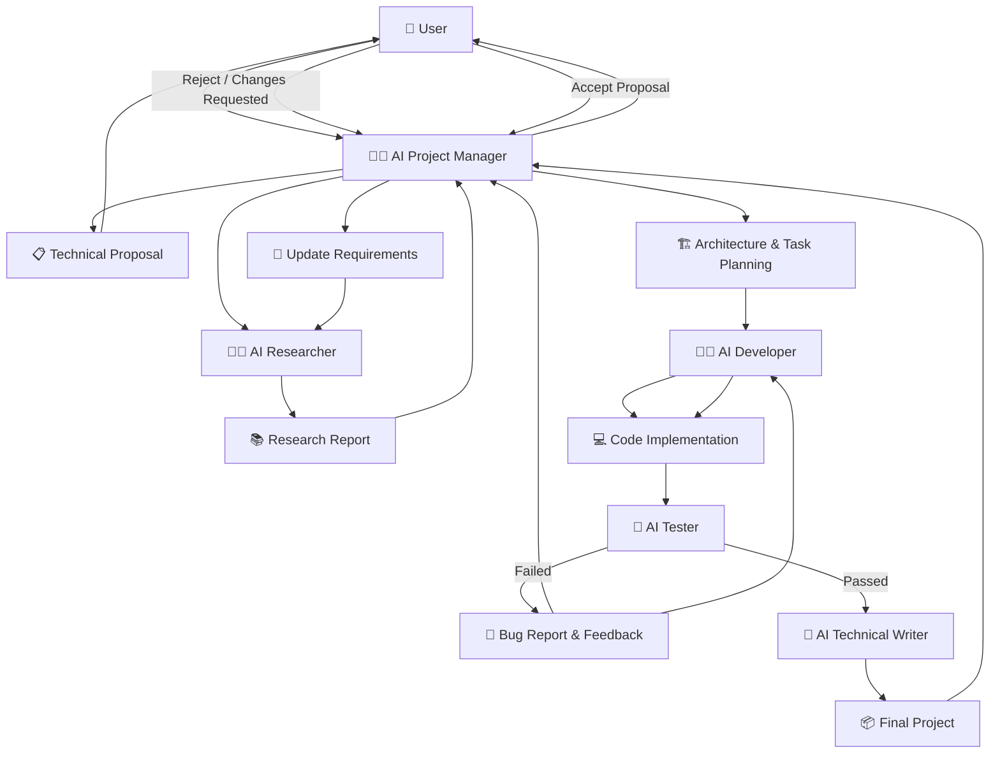
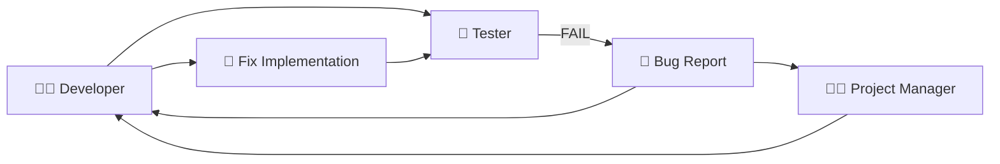
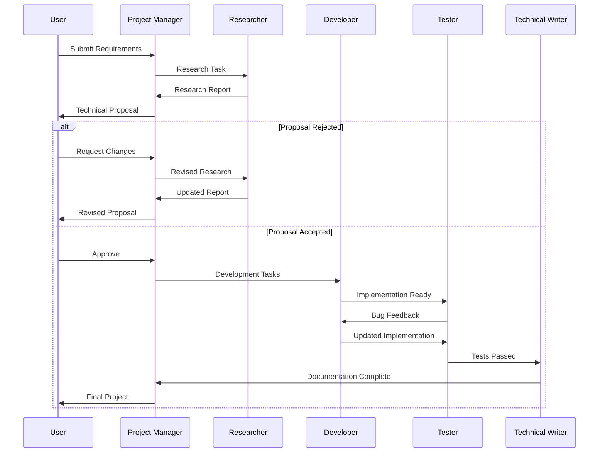

# Oxygen 
An AI Software Development Company that locally runs virtually.

---

### Meet the Team
- User: Which is you or client.
- AI Project Manager (Del): Which directly talks with you.
- AI Researcher (Toky): Which do research on user requirements.
- AI Developer (Bang): Which write codes and files for you and run code in a sandbox.
- AI Tester (Beji): Which test and debug the code written by AI Developer.
- AI Technical Writer (Wash): Which write documentations, product manual, installation guide and helps regarding customer support.
```
Del means Delhi
Toky means Tokyo
Bang means Bangalore
Beji means Bejieng
Wash means Washington DC
```
---

## How Oxygen Works

Oxygen is an AI-powered software development team where specialized AI agents collaborate to take a software idea from requirements to a tested and documented project.

The user communicates directly with the **AI Project Manager**, while the Project Manager coordinates the rest of the team.

### Team

| Agent                    | Responsibility                                                                                                           |
| ------------------------ | ------------------------------------------------------------------------------------------------------------------------ |
| 🧑‍💼 AI Project Manager | Understands requirements, coordinates agents, manages tasks, communicates with the user, and handles approvals/revisions |
| 🧑‍🔬 AI Researcher      | Researches technologies, architectures, libraries, models, documentation, and technical alternatives                     |
| 👨‍💻 AI Developer       | Designs and implements the software, modifies code, fixes bugs, and maintains the project repository                     |
| 🧪 AI Tester             | Tests the implementation, identifies bugs, validates requirements, and provides feedback                                 |
| 📝 AI Technical Writer   | Creates README files, API documentation, setup guides, architecture documentation, and other technical documents         |

---

## Development Flow



### 1. Requirement Gathering

The user describes what they want to build.

For example:

> "Build an AI-powered OCR API that extracts text from images."

The AI Project Manager analyzes the request and converts it into structured requirements, constraints, goals, and tasks.

### 2. Research Phase

The Project Manager delegates technical investigation to the **AI Researcher**.

The Researcher may investigate:

* Suitable models and libraries
* Existing solutions
* System architecture
* Frameworks and APIs
* Deployment options
* Performance considerations
* Security considerations
* Licensing and compatibility

The Researcher returns a structured research report to the Project Manager.

### 3. Proposal & Human Approval

The Project Manager converts the research into a proposed technical approach and presents it to the user.

There are two possible paths:

**Rejected**

```text
User
  ↓
Proposal Rejected
  ↓
Project Manager
  ↓
Requirements Updated
  ↓
Researcher
  ↓
New Research
  ↓
New Proposal
```

The Project Manager may also provide feedback to the Researcher and request more focused research.

**Accepted**

```text
User
  ↓
Proposal Accepted
  ↓
Project Manager
  ↓
Architecture & Task Planning
```

### 4. Development

After approval, the Project Manager creates development tasks and assigns them to the **AI Developer**.

The Developer:

1. Understands the architecture.
2. Creates or modifies project files.
3. Installs required dependencies.
4. Implements features.
5. Runs the application.
6. Commits or prepares the implementation for testing.

### 5. Automated Testing

The completed implementation is passed to the **AI Tester**.

The Tester validates:

* Functional requirements
* Unit tests
* Integration behavior
* API responses
* Error handling
* Code quality
* Basic security and reliability
* Whether the implementation matches the approved proposal

### 6. Failure & Feedback Loop

When testing fails, the Tester creates a structured bug report.



The feedback can be sent to both the Project Manager and Developer.

The Developer fixes the issue and the system sends the updated implementation back to the Tester.

This loop continues until the required tests pass or the Project Manager decides that the approach needs to be reconsidered.

### 7. Documentation

Once the implementation passes testing, the **AI Technical Writer** receives the finalized project information.

The Technical Writer can generate:

* `README.md`
* Installation instructions
* Usage documentation
* API documentation
* Architecture documentation
* Configuration guides
* Developer documentation
* Changelog

### 8. Final Delivery

After development, testing, and documentation are complete, the Project Manager assembles the final project output and presents it to the user.

```text
Requirements
    ↓
Research
    ↓
Proposal
    ↓
User Approval
    ↓
Architecture
    ↓
Development
    ↓
Testing
    ↓
Bug Fix Loop ───────────────┐
    ↓                       │
Tests Passed                │
    ↓                       │
Documentation               │
    ↓                       │
Final Project <─────────────┘
    ↓
User
```

---

## Parallel & Idle Research

Oxygen can also perform research that is not immediately required for the current development task.

For example, while the Developer is implementing an OCR service, the Researcher can investigate related topics extracted from the user's requirements:

```text
Current Development
        │
        ├── OCR API
        │
        └── Idle Research Queue
              ├── Model Quantization
              ├── CPU Optimization
              ├── Deployment Options
              ├── Security
              └── Alternative OCR Models
```

When the Researcher becomes relevant to the active workflow again, previously collected research can be provided to the Project Manager.

---

## AI Team Communication

Agents do not rely only on conversational text. Oxygen can use structured internal messages and events to coordinate the team.



---

## Pixel Office

Oxygen can visualize the AI team in a miniature pixel-art office.

The virtual office reflects the actual backend state of each agent.

```text
┌─────────────────────────────────────────────────────┐
│                     OXYGEN HQ                        │
│                                                     │
│   🧑‍💼 PM                 🧑‍🔬 Researcher            │
│   [Desk]                    [Desk]                 │
│                                                     │
│              ┌─────────────────────┐                │
│              │    MEETING ROOM     │                │
│              │  🧑‍💼 🧑‍🔬 👨‍💻 🧪      │                │
│              └─────────────────────┘                │
│                                                     │
│   👨‍💻 Developer                         🧪 Tester    │
│   [Workstation]                       [Lab]        │
│                                                     │
│                    ☕ Coffee Area                   │
│                                                     │
│                              📝 Technical Writer    │
│                                                     │
└─────────────────────────────────────────────────────┘
```

Agent states can include:

```text
IDLE
THINKING
RESEARCHING
CODING
TESTING
IN_MEETING
COFFEE_BREAK
RELAXING
CELEBRATING
ERROR
```

These visual states are connected to real backend events, so the pixel office acts as a visual representation of what Oxygen's AI team is actually doing.


### Frontend UI
Pixelated corporate style 2D miniature office

---
Developed by Arshvir with lots of dedication and love <3 :)
