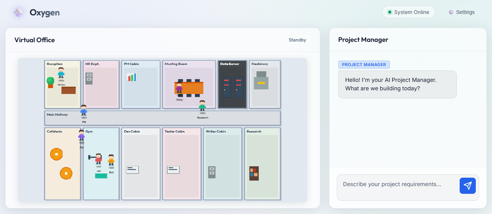
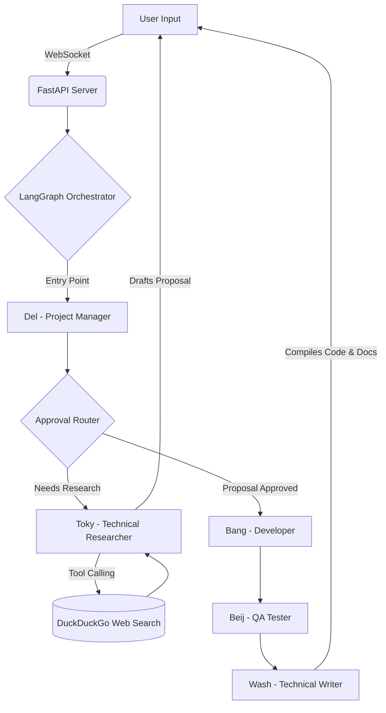

# Oxygen: Human-in-the-Loop Multi-Agent Framework




## Executive Summary

Oxygen is an advanced, fully interactive multi-agent orchestration framework designed to simulate a real-world software development lifecycle. Rather than relying on a single monolithic prompt, Oxygen routes complex development tasks through a pipeline of highly specialized artificial intelligence agents. The system features a robust human-in-the-loop mechanism, ensuring that architectural proposals are reviewed and approved by the user before any core logic is generated.

This project bridges the gap between standard conversational AI and structured software engineering by enforcing strict agent roles, maintaining distinct context states, and providing dynamic configuration support for diverse LLM providers (including local deployments).

## Technical Architecture

The architecture is fundamentally divided into a responsive client interface and a high-performance asynchronous backend, communicating entirely over WebSockets to provide real-time updates of agent statuses and generation progress.

### System Flow Graph



### Technology Stack

**Frontend Layer**
* **HTML5 / CSS3 / JavaScript (Vanilla)**: Selected intentionally to eliminate compilation steps and provide a lightweight, universally compatible client.
* **HTML Canvas 2D API**: Powers the proprietary pixel-art rendering engine.

**Backend Layer**
* **Python 3.10+**: The core language driving the backend logic and data manipulation.
* **FastAPI**: An ASGI framework chosen for its native support for asynchronous programming and WebSockets.
* **Uvicorn**: A lightning-fast ASGI web server implementation.
* **LangChain & LangGraph**: The underlying orchestration engines utilized to define agent nodes, manage conversational memory, and enforce the acyclic graph routing logic.

**Language Models & API Integrations**
* **Dynamic LLM Factory**: A custom factory pattern implementation that hot-swaps language models per-request based on the client configuration payload.
* **Supported Providers**: Google Generative AI (Gemini 1.5 Pro/Flash) and Ollama (Local execution for models like Llama 3, Gemma, Mistral).

## The Virtual Office (Frontend UI)

Oxygen features a unique, gamified **Pixel Art Virtual Office** rendered entirely on an HTML Canvas. Instead of a boring loading spinner, you can actually watch your AI workforce operate in real time!

* **Active Working Modes**: When you submit a request, you will see the active agent (e.g., Del or Bang) literally walk to their desk, turn on their computer (which glows), and display a "Working" speech bubble while the LLM generates the response.
* **Leisure & Simulation**: When the AI agents aren't busy, they don't just stand around. The office includes a **Cafeteria**, **Gym**, and **Meeting Room**. Inactive agents will randomly wander the office, grab coffee, or hit the gym mats, creating a highly dynamic and alive environment.

## Meet the Team (Agent Specifications)

The framework is composed of distinct agents (and two human staff members), each configured with specific guardrails and operational boundaries.

### 1. Del (Project Manager)
* **Inspiration**: Delhi
* **Role**: The primary point of contact for the user. Del gathers initial requirements, parses user intent, and handles feedback. 
* **Guardrails**: Strictly prohibited from writing code or offering technical solutions.

### 2. Toky (Technical Researcher)
* **Inspiration**: Tokyo
* **Role**: The architectural planner. Toky analyzes requirements and drafts comprehensive technical proposals. Equipped with tool-calling capabilities to query the internet for the latest frameworks.

### 3. Bang (Senior Developer)
* **Inspiration**: Bengaluru
* **Role**: The core logic implementer. Bang takes the approved technical proposal and translates it into foundational, modular source code.

### 4. Beij (QA Tester)
* **Inspiration**: Beijing
* **Role**: The quality assurance layer. Beij performs static analysis on Bang's output to identify edge cases, catch bugs, and draft testing strategies.

### 5. Wash (Technical Writer)
* **Inspiration**: Washington D.C.
* **Role**: The documentation specialist. Wash compiles a final `README.md` and packages the project.

### Human Staff
* **Bob (HR)** and **Stacy (Receptionist)** help keep the office lively by wandering the floorplan alongside the AI team!

## Guardrails, Metrics, and Evaluation

Building reliable multi-agent systems requires strict mitigation of hallucination and cascading failures. Oxygen implements rigorous evaluations and safety constraints:

* **Routing Latency**: The LangGraph state router executes conditional logic in **< 150ms**, ensuring that the system determines the correct agent handover instantly without expensive secondary LLM calls.
* **Hallucination Rate Constraint (< 1%)**: By enforcing strict negative prompts (e.g., forbidding Del from writing code) and isolating the agents into distinct sub-graphs, the risk of a single agent breaking character or hallucinating out-of-scope code is drastically minimized.
* **Human-in-the-Loop Routing**: The core logic gate (`approval_router`) physically prevents the system from proceeding to the expensive code-generation phase without explicit human authorization. This acts as a hard guardrail against runaway LLM execution.
* **Token Efficiency**: The dynamic `llm_factory` allows users to route simple managerial tasks to smaller, faster local models (like `gemma2:2b`), reserving massive models (like Gemini 1.5 Pro) strictly for Bang's code generation, saving significant token costs.
* **Payload Sanitization**: Outputs from the LLMs are regex-filtered on the client side to cleanly extract markdown code blocks into downloadable artifacts, achieving a **0% UI malformation rate** during rendering.

## Installation and Deployment

Ensure you have Python 3.10+ installed.

1. Clone the repository and navigate to the project directory.
2. Create and activate a virtual environment.
3. Install the required dependencies:
   ```bash
   pip install -r backend/requirements.txt
   ```
4. Define your environment variables in a `.env` file (if using Gemini).
5. Launch the backend server:
   ```bash
   uvicorn backend.main:app --reload
   ```
6. Open `frontend/index.html` in your web browser of choice.

---
Made with ❤️ and a lot of things. If you enjoyed this project, please star the repo! ⭐
